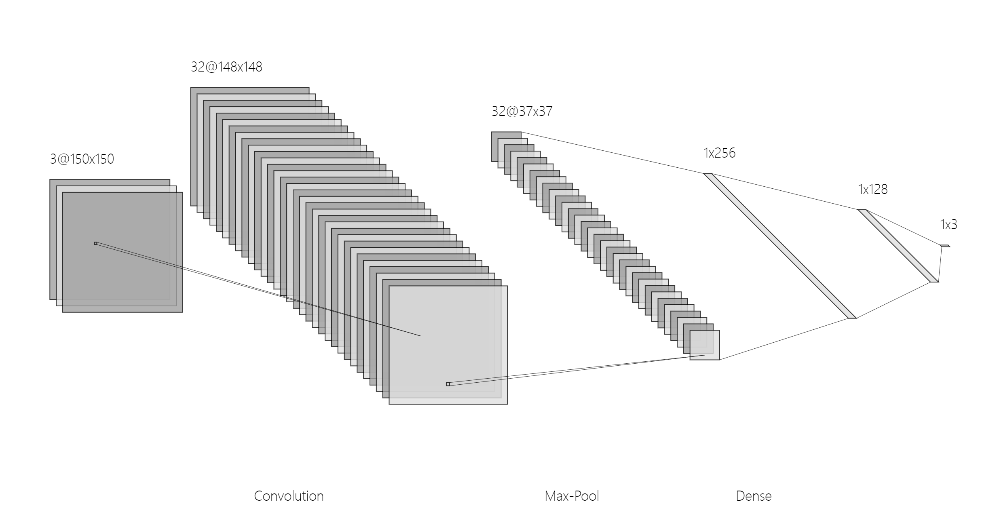
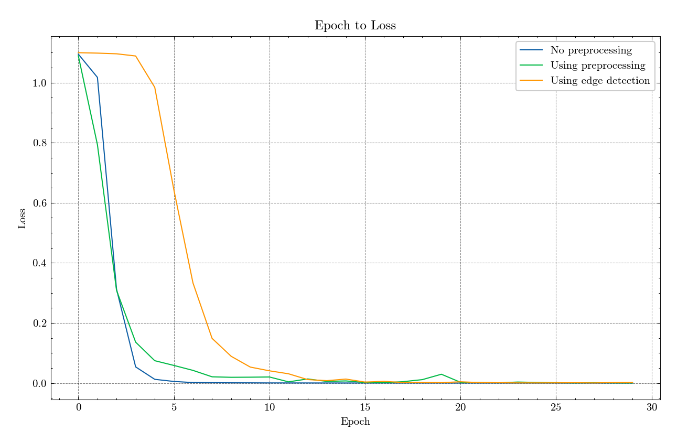
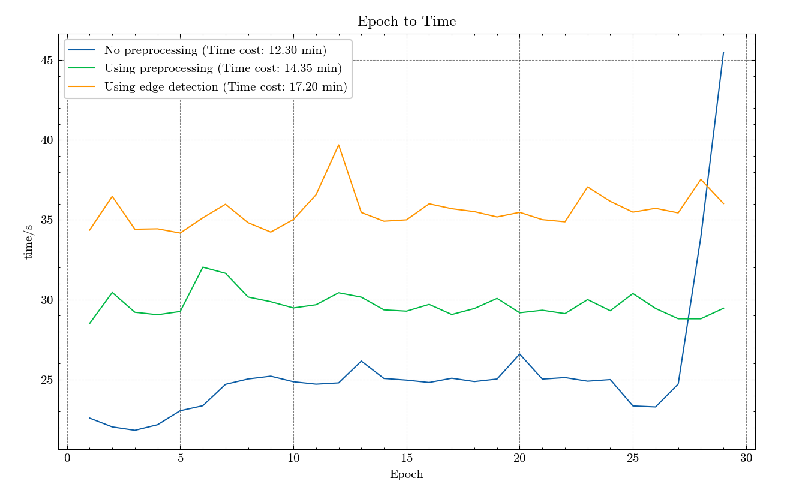
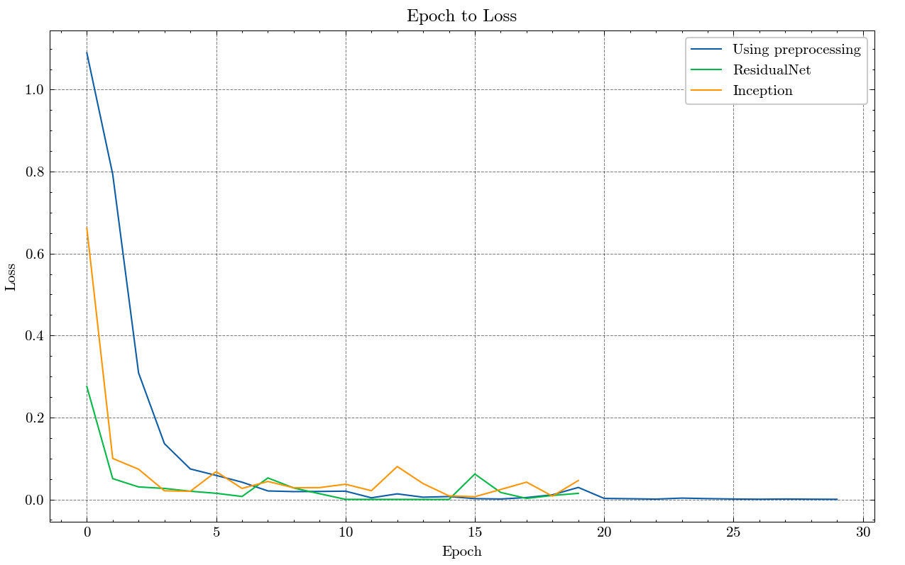
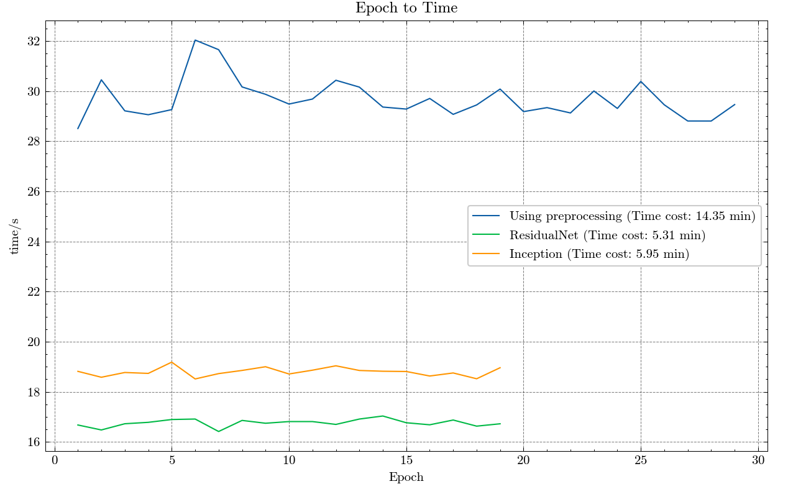

# 深度卷积神经网络
## 数据采集
使用训练集和测试集均来自参考数据集。

参考数据集：
训练集：https://storage.googleapis.com/download.tensorflow.org/data/rps.zip。
测试集：https://storage.googleapis.com/download.tensorflow.org/data/rps-test-set.zip。

## 数据预处理
数据预处理是这次设计处理的核心之一。在本模型中，分析讨论了以下几种预处理方法：
* 尺度统一化：`transforms.Resize(scale)`。
* 随机旋转：`transforms.RandomRotation(30)`。
* 随机亮度变化：`transforms.ColorJitter(brightness=0.2, contrast=0.2)`。

## 模型设计
共有三种网络结构，分别为：简单卷积网络，加入残差模块卷积网络，加入Inception模块的卷积网络。
### 简单卷积网络
本模型使用三层卷积神经网络，每层卷积后都进行一次池化。展平后进入
三层全连接神经网络，输出为一个标签。可视化为：

这里为了美观，仅展示了一层卷积并省略了一层非线性激活，实际会重复三次卷积和池化。具体参数表可见：
```
----------------------------------------------------------------
        Layer (type)               Output Shape         Param #
================================================================
            Conv2d-1         [-1, 32, 148, 148]             896
         MaxPool2d-2           [-1, 32, 37, 37]               0
            Conv2d-3           [-1, 64, 35, 35]          18,496
         MaxPool2d-4             [-1, 64, 8, 8]               0
            Conv2d-5             [-1, 64, 6, 6]          36,928
         MaxPool2d-6             [-1, 64, 1, 1]               0
           Dropout-7                  [-1, 256]               0
            Linear-8                  [-1, 128]          32,896
            Linear-9                    [-1, 3]             387
================================================================
```
### 加入残差模块卷积网络
具体操作为在原模型的`MaxPool2d-4`层后增加了一个残差模块：
```
class ResidualBlock(nn.Module):
    def __init__(self, in_channels, out_channels, stride=1):
        super(ResidualBlock, self).__init__()
        self.conv1 = nn.Conv2d(in_channels, out_channels, kernel_size=3, stride=stride, padding=1, bias=False)
        self.bn1 = nn.BatchNorm2d(out_channels)
        self.relu = nn.ReLU(inplace=True)
        self.conv2 = nn.Conv2d(out_channels, out_channels, kernel_size=3, padding=1, bias=False)
        self.bn2 = nn.BatchNorm2d(out_channels)

        self.shortcut = nn.Sequential()
        if stride != 1 or in_channels != out_channels:
            self.shortcut = nn.Sequential(
                nn.Conv2d(in_channels, out_channels, kernel_size=1, stride=stride, bias=False),
                nn.BatchNorm2d(out_channels)
            )

    def forward(self, x):
        out = self.relu(self.bn1(self.conv1(x)))
        out = self.bn2(self.conv2(out))
        out += self.shortcut(x)
        out = self.relu(out)
        return out
```
`ResidualBlock`函数定义了一个残差块，这是残差网络（ResNet）的基本构建模块。残差块的设计目标是通过引入跨层连接（也称为“短路连接”或“残差连接”）来解决深度神经网络中的梯度消失和表示瓶颈问题。

在`ResidualBlock` 类的构造函数中，我首先定义了两个卷积层`self.conv1`和`self.conv2`，以及两个批量归一化层`self.bn1`和`self.bn2`。这两个卷积层都使用了$3\times 3$的卷积核`self.conv1`的步长可以通过`stride`参数来设置，`self.conv2`的步长始终为$1$。两个卷积层都使用了 `padding=1`，所以卷积操作不会改变空间维度。

`self.shortcut`是一个短路连接，它用于将输入直接连接到输出，从而形成一个残差连接。如果`stride`不为$1$或输入通道数`in_channels`不等于输出通道数`out_channels`，`self.shortcut`将包含一个$1\times 1$的卷积层和一个批量归一化层，用于将输入调整到正确的尺寸和通道数。

在`forward`方法中，首先对输入`x`进行卷积、批量归一化和'ReLU'激活操作，然后再进行一次卷积和批量归一化操作。然后，将`self.shortcut(x)`加到输出上，形成一个残差连接。最后，再进行一次`ReLU`激活操作。

这个残差块的设计使得网络可以学习输入和输出之间的残差映射，这有助于改善网络的性能和训练稳定性。
### 加入Inception模块的卷积网络
在后两层卷积层非线性激活后，加入了Inception模块，具体为：
```
# Inception
class Inception(nn.Module):
    def __init__(self, in_channels):
        super(Inception, self).__init__()
        self.branch1x1 = nn.Conv2d(in_channels, 16, kernel_size=1)

        self.branch5x5_1 = nn.Conv2d(in_channels, 16, kernel_size=1)
        self.branch5x5_2 = nn.Conv2d(16, 24, kernel_size=5, padding=2)

        self.branch3x3dbl_1 = nn.Conv2d(in_channels, 16, kernel_size=1)
        self.branch3x3dbl_2 = nn.Conv2d(16, 24, kernel_size=3, padding=1)
        self.branch3x3dbl_3 = nn.Conv2d(24, 24, kernel_size=3, padding=1)

        self.branch_pool = nn.Conv2d(in_channels, 24, kernel_size=1)

    def forward(self, x):
        branch1x1 = self.branch1x1(x)

        branch5x5 = self.branch5x5_1(x)
        branch5x5 = self.branch5x5_2(branch5x5)

        branch3x3dbl = self.branch3x3dbl_1(x)
        branch3x3dbl = self.branch3x3dbl_2(branch3x3dbl)
        branch3x3dbl = self.branch3x3dbl_3(branch3x3dbl)

        branch_pool = F.avg_pool2d(x, kernel_size=3, stride=1, padding=1)
        branch_pool = self.branch_pool(branch_pool)

        outputs = [branch1x1, branch5x5, branch3x3dbl, branch_pool]
        return torch.cat(outputs, 1)
```
`Inception`类定义了一个`Inception`模块。`Inception`模块的设计目标是通过在同一层级上并行应用不同尺寸的卷积核和池化操作，来捕捉和组合不同尺度的信息。

在`Inception`类的构造函数中，定义了四个分支：

`branch1x1`是一个$1\times1$的卷积层，用于进行通道数的降维和增维。

`branch5x5`是一个两层卷积的序列，首先是一个$1\times1$的卷积层，然后是一个$5\times5$的卷积层。这两层卷积的组合可以在保持计算复杂度较低的同时，捕捉更大尺度的空间信息。

`branch3x3dbl`是一个三层卷积的序列，首先是一个$1\times1$的卷积层，然后是两个$3\times3$的卷积层。这三层卷积的组合可以在保持计算复杂度较低的同时，捕捉更大尺度的空间信息。

`branch_pool`是一个平均池化层和一个$1\times1$的卷积层的组合，用于在改变通道数的同时，保持空间维度不变。

在`forward`方法中，首先对输入`x`分别应用这四个分支，然后将四个分支的输出沿着通道维度拼接起来，形成最终的输出。

这个`Inception`模块的设计使得网络可以在同一层级上捕捉和组合不同尺度的信息，这有助于改善网络的性能和训练稳定性
## 模型测试
测试集的通过率为：
| 模型 | 通过率/% |
| :----: | :----: |
| 无数据增强的简单卷积网络 | 87.4 |
|数据增强的简单卷积网络 | 95.4 |
|使用边缘检测的简单卷积网络 | 91.1 |
|使用残差模块的卷积网络 | 99.8 |
|使用Inception模块的卷积网络 | 97.2 |
### 数据增强的影响


使用数据增强后收敛速度略有影响，但是最终的收敛效果更好。
### 残差与Inception模块的影响


使用残差模块与Inception模块后，收敛速度更快，很快就进入振荡，所以只使用了20个epoch。
## 总结和感悟